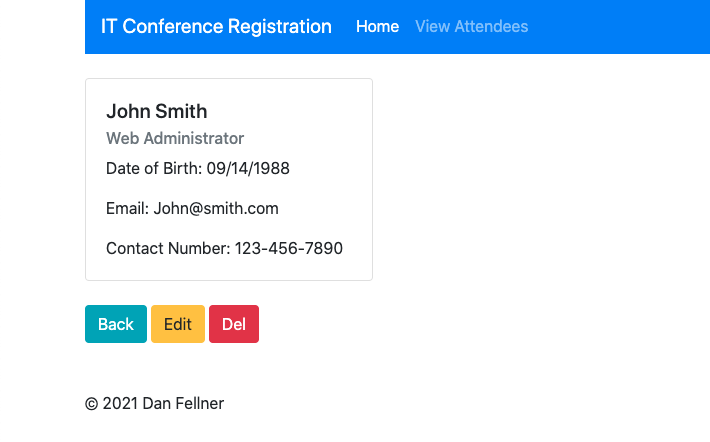

# Attendance App

### Overview

This app allows for users to register for a fake IT conference. The purpose is to display CRUD functionality in the form of using PHP global variables and PHP PDO to connect with a remote MySQL database. 

##### Register

##### View Registered Attendees

##### View Individual Attendee

#####  Edit Details

##### View Changed Details

### Technologies 
- PHP
    + Object Oriented Programming
    + PDO
    + global environment variables
- Javascript
- Bootstrap
- HTML

### Future Improvements

- Improving the app through with more elaborate data endpoints by expanding knowledge of OOP and PDO.
- Upgrading to a remote server with more flexibility, less potential warnings that MySQL workbench will pick up.

### Links

- [Application](https://attendance-project-dfellner.herokuapp.com)